# Ambulance Booking
We provide most advance emergency ambulance service which contains Air ambulance service, Ac & non Ac, freezing ambulance, water Ambulance & Economy ambulance.
## Features
- Login/Sign up
- Ambulance
- Approve user request
- Choose ambulance
- Make payment

## Instruction of uses
1. CliniCare provides various kinds of emergency ambulance service to people ,but the booking system is the same for all kinds.
2. For Ambulance booking ,the patient/user first has to login to our system.If the patient is a new user then he/she has to create an account to get the service.
3. After login to the system he/she can search for the ambulance from the filter category.
4. If he/she finds the desired ambulance then he/she has to choose location,preferable time to get the service.
5. After filling the information on the ambulance booking form they have to confirm the booking.
6. After confirmation, the patient/user can view the driver information and has to ensure payment via online.
7. Then the user/patient can leave the system.
8. As administration provides rental support ,so admin could also view the driver information for authentication.
9. After taking the service, the patient/user can rate the service which is optional.

## Overview
### User view
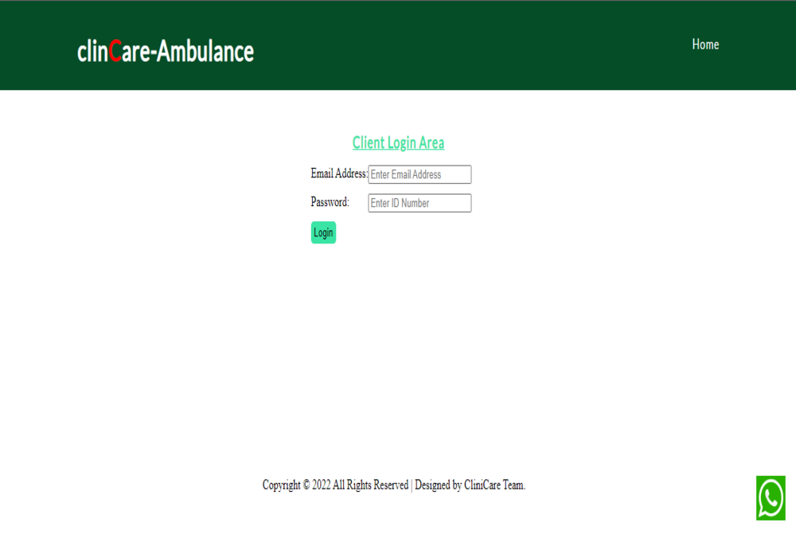
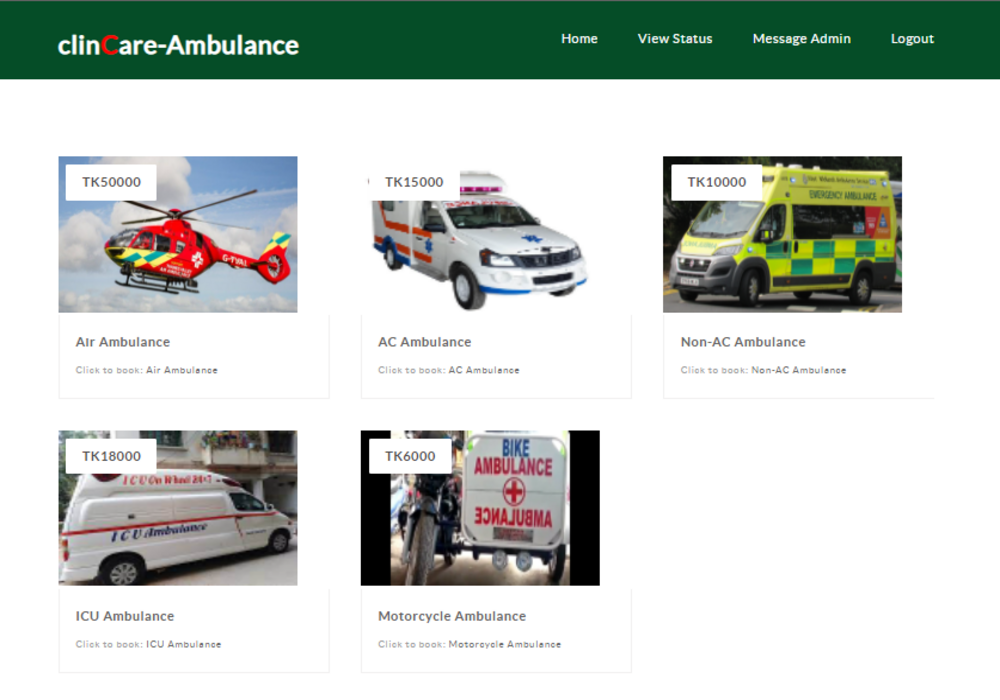
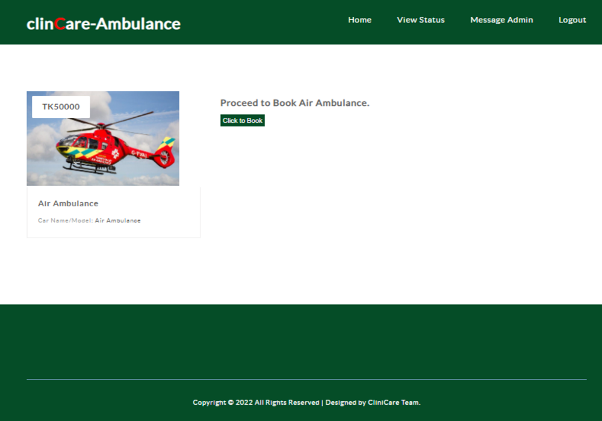
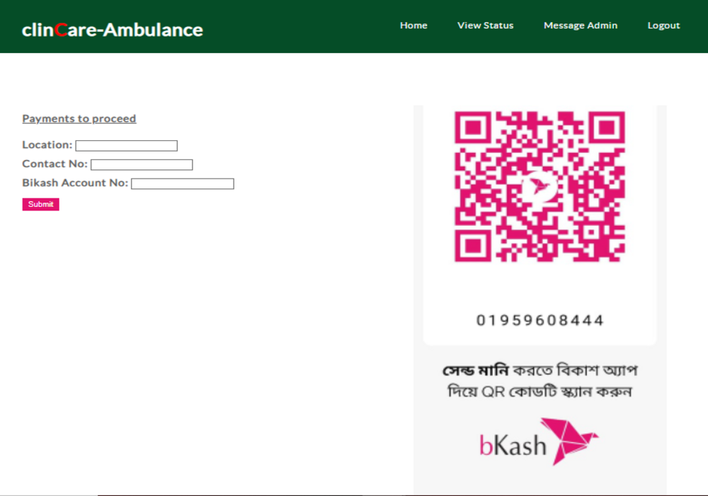
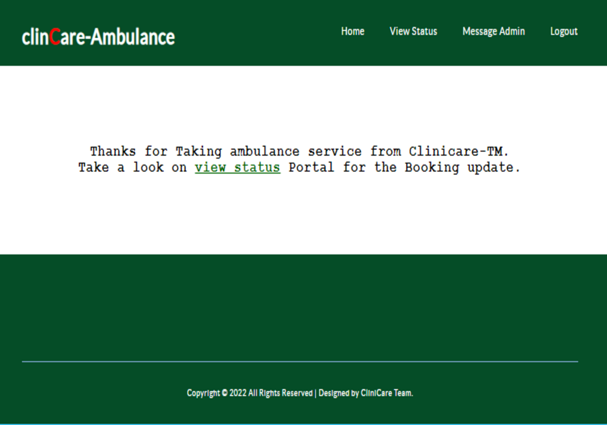
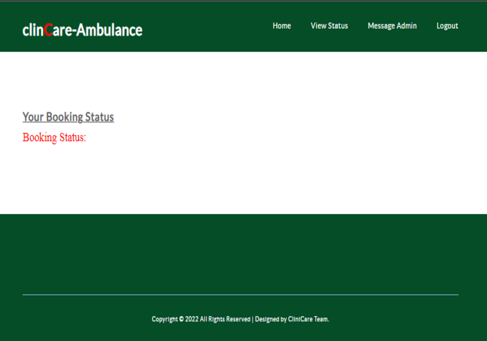
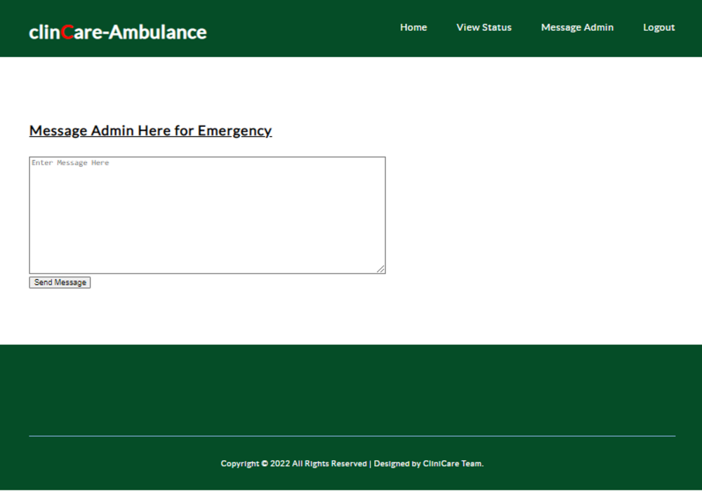
***
### Admin view
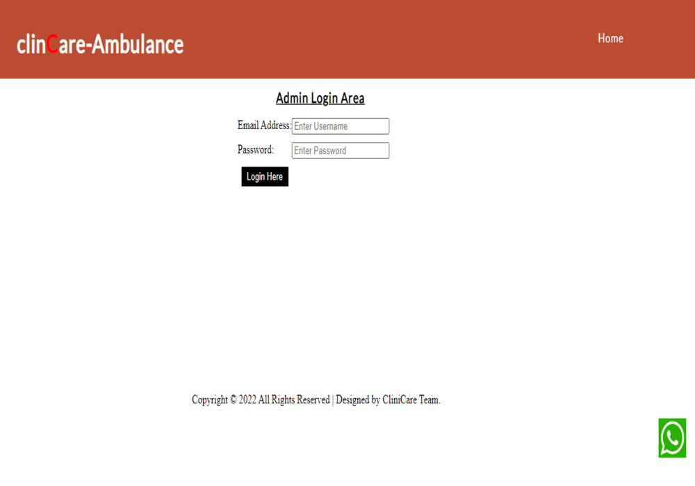
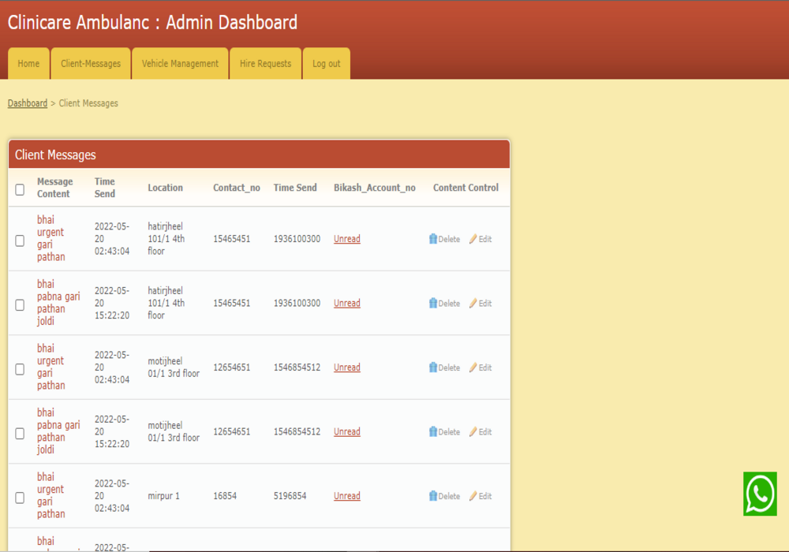
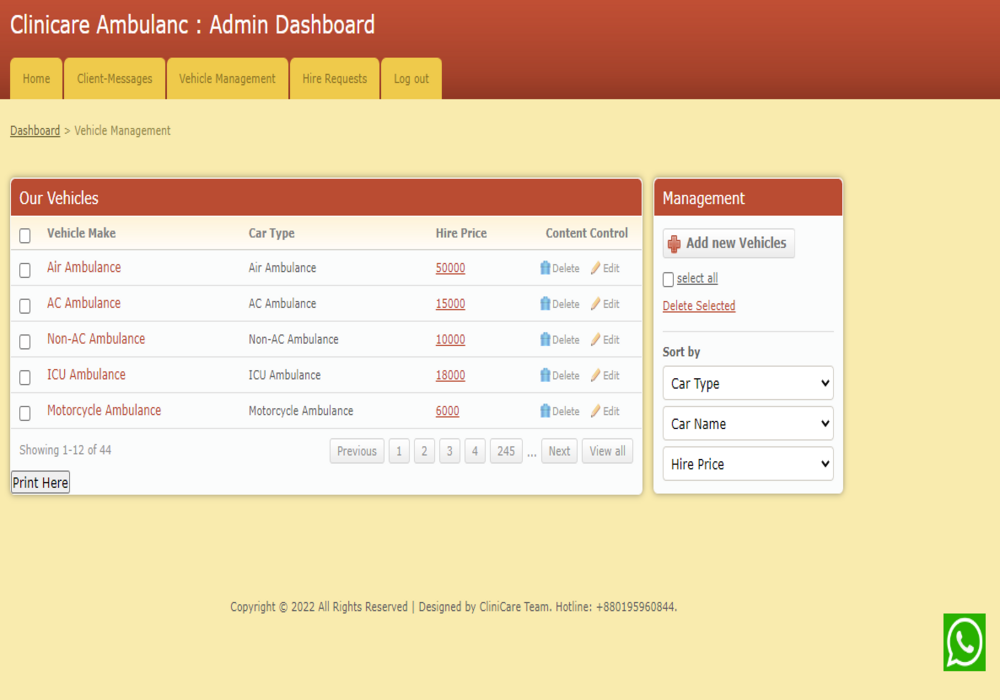
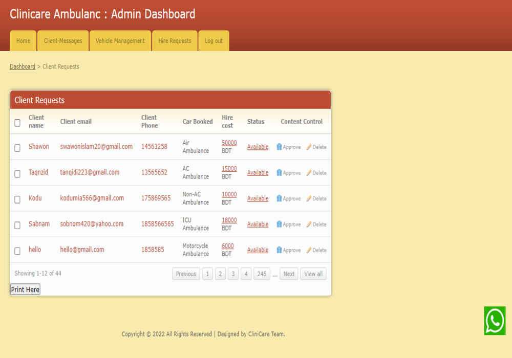
