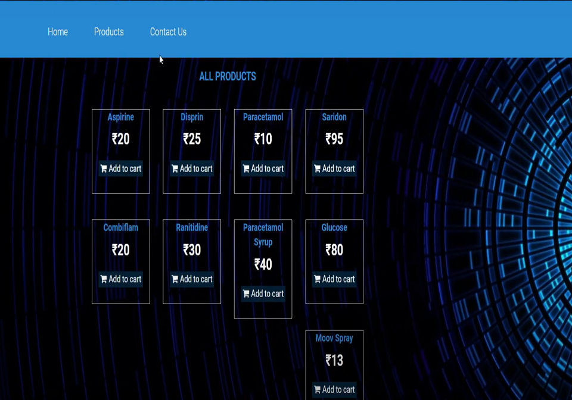

# Medicine shop
We also have online medicine store where patient will be able to find any kind of madicines with a fastest medicine delivery service all over bangladesh at a low price range for any kind of medicine.
## Features
1. Deliver medicine.
2. Create Account.
3. Sign In/ Sign Out
4. Search Medicine.
5. Add to Cart.
6. Payment (demo).

## Instruction of uses
1. CliniCare has its own medical store from where patients/user can buy medicine via online and also get home delivery.
2. To get the delivery service the patient/user first has to login to our system.If the patient is a new user then he/she has to create an account to get the service.
3. After that patient/user has to upload a copy of his/her prescription to the system for selecting medicine.
4. Then the patient/user will search for his/her required medicine from the server.
5. If he/she finds the medicine then they have to click on the “Add to cart”option to get the medicine where he/he has to provide some information like location,id,time for taking the home delivery service.
6. After confirmation, the user has to make the payment via online.
7. Administration will handle the whole delivery process of medicine.

## Overview

