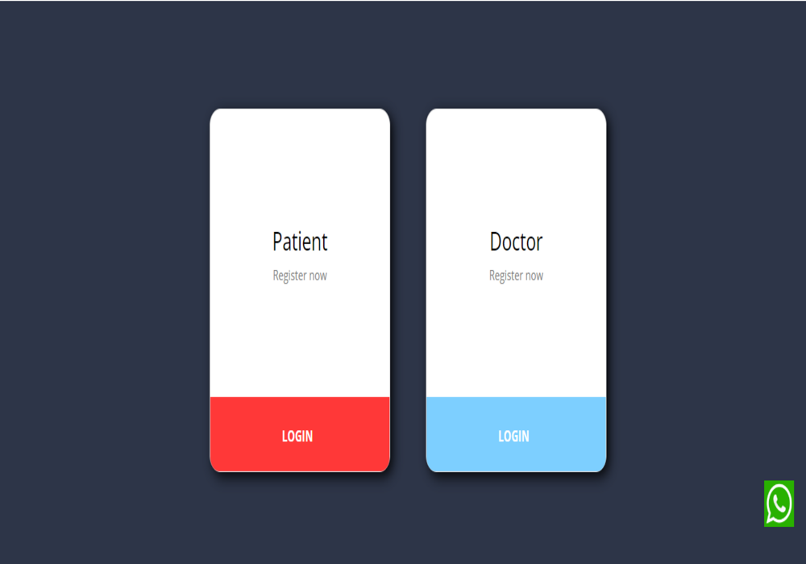
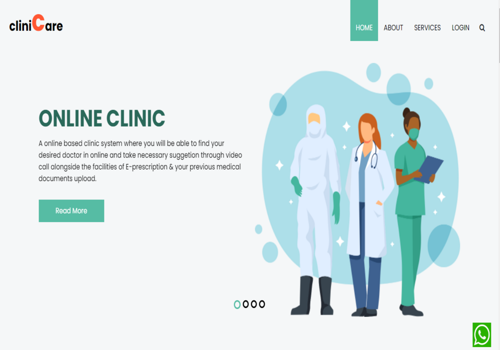
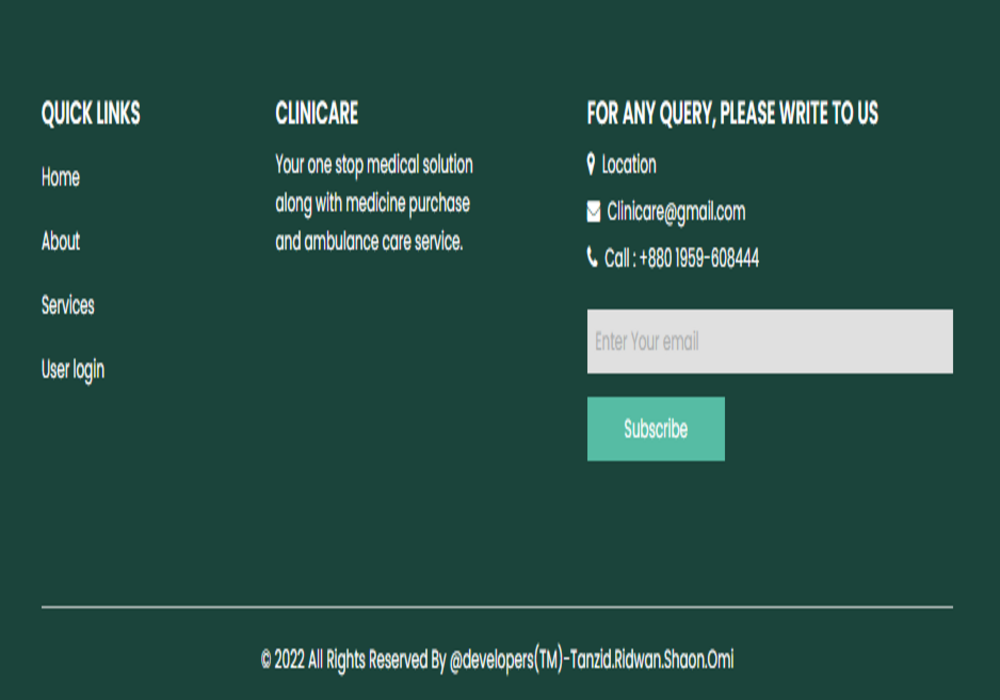
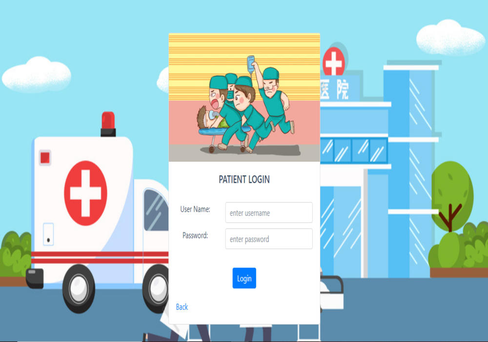
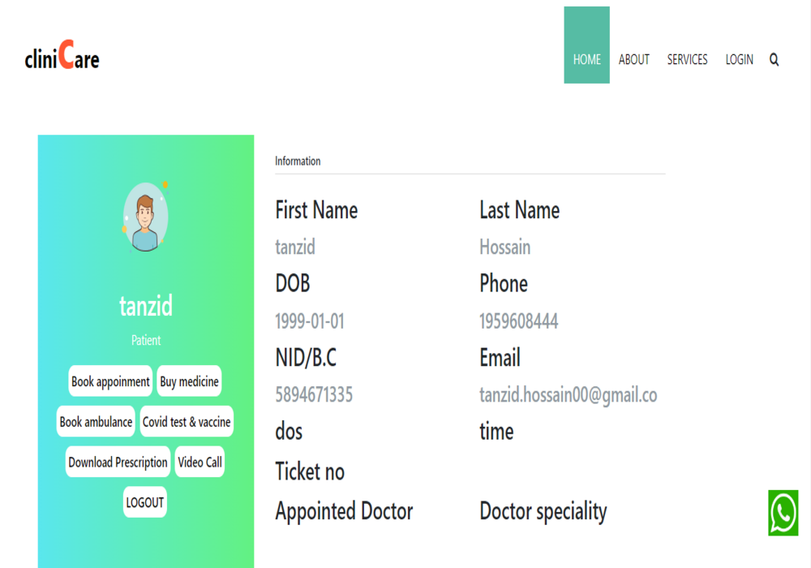
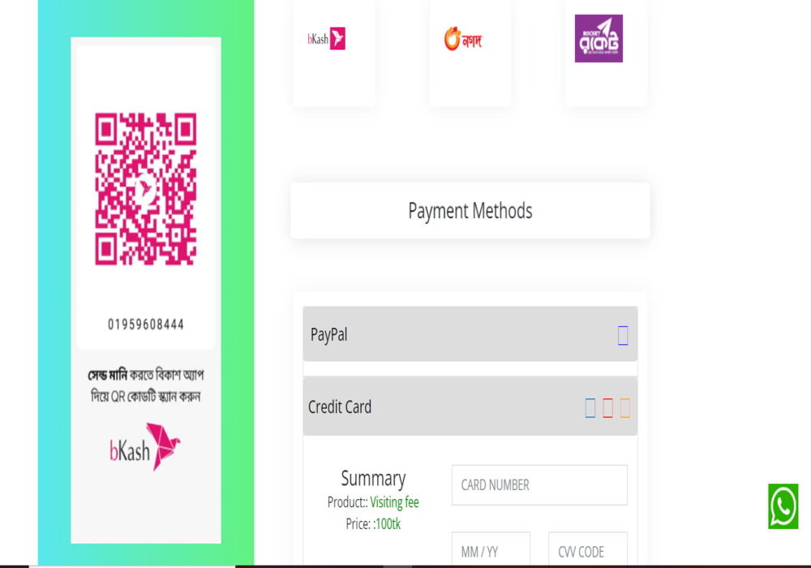
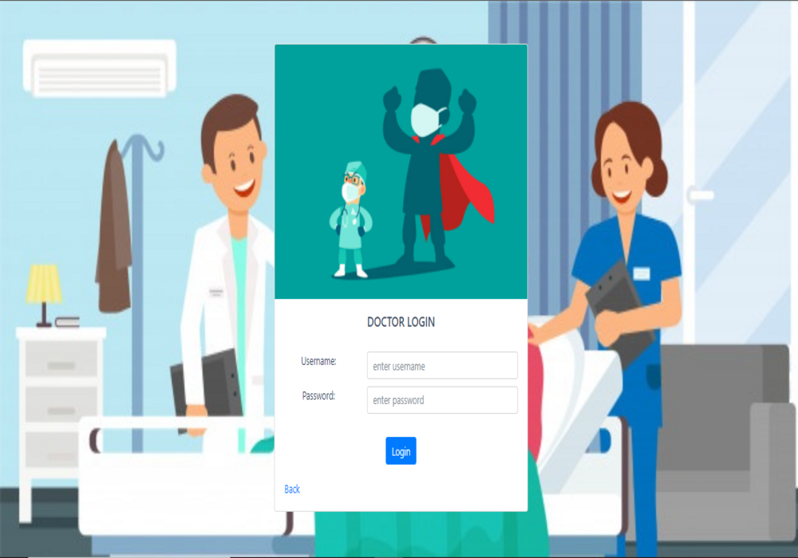
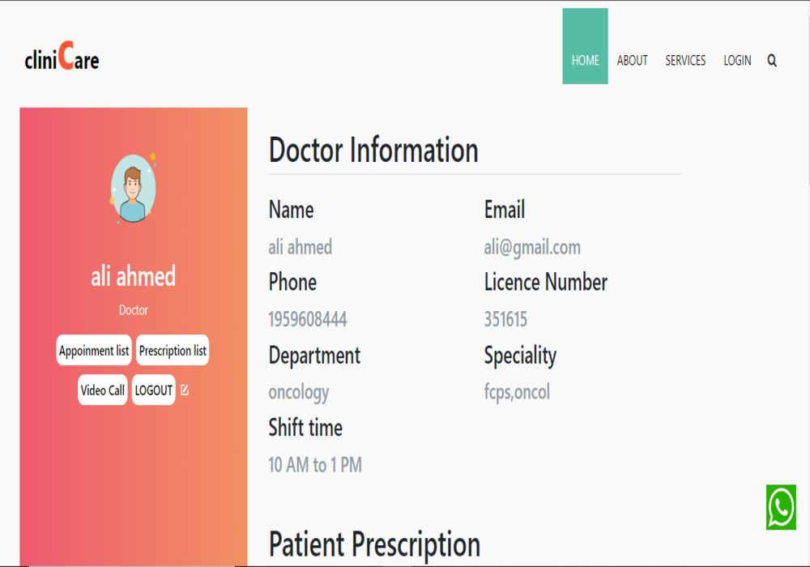
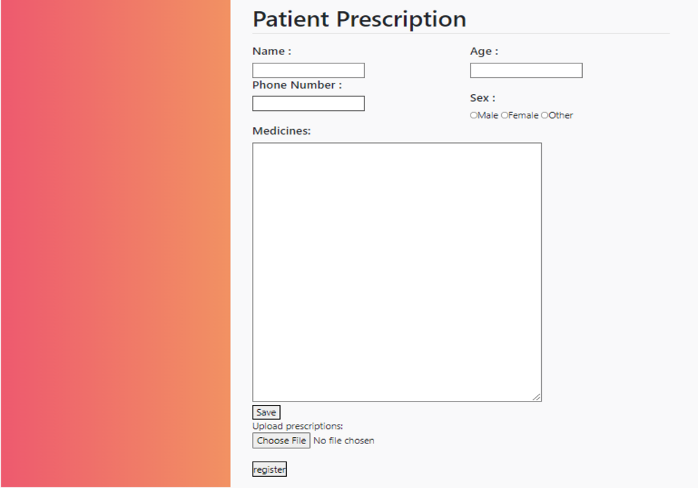

# Doctor and Patient 
A online based clinic system where you will be able to find your desired doctor in online and take necessary suggetion through video call alongside the facilities of E-prescription & your previous medical documents upload.

## Features
* Doctor
    * Login.
    * Signup.
    * View appointment.
    * Upload prescription.    
* Patient
    * Login
    * Signup
    * Book appointment
    * Upload medical documents
    * Viwe medical history.
## Instruction of uses
* Patient instruction
    1. In cliniCare system to get required health services, patient/user first have to login to the system.
    2. If the patient is a new user then he/she has to create an account to get services from cliniCare.
    3. As cliniCare is an online based health care management system,so here patient connect with doctors via online video calling platform.
    4. To consult a doctor ,first patient has to book appointment on his/her tentative time.
    5. Patient can search doctors for appointments by viewing doctor’s details from the website. 
    6. If the Appointment booking is done then the user have to pay the doctor via online payment and after that he/she will get services from doctor.
    7. Here user/patient can upload his/her medical record so that doctor can understand the patient.
    8. During the consultation period the user/patient will get e-prescription from doctor through the system.
* Doctor instruction
    1. As cliniCare is an online based healthcare platform, so doctors provide healthcare  services via online to patients.
    2. For providing service to patients, doctors have to login to the system.If a doctor is new on this platform he/she has to create an account first. 
    3. After login to the system, the doctor can consult those patients who have already booked  their appointment on the system.
    4. Then the doctor can view the patient's previous medical record,and can provide a new e-prescription to the patient.

 

## Overview

***
### **Patient overview**

***
### **Doctor overview**

